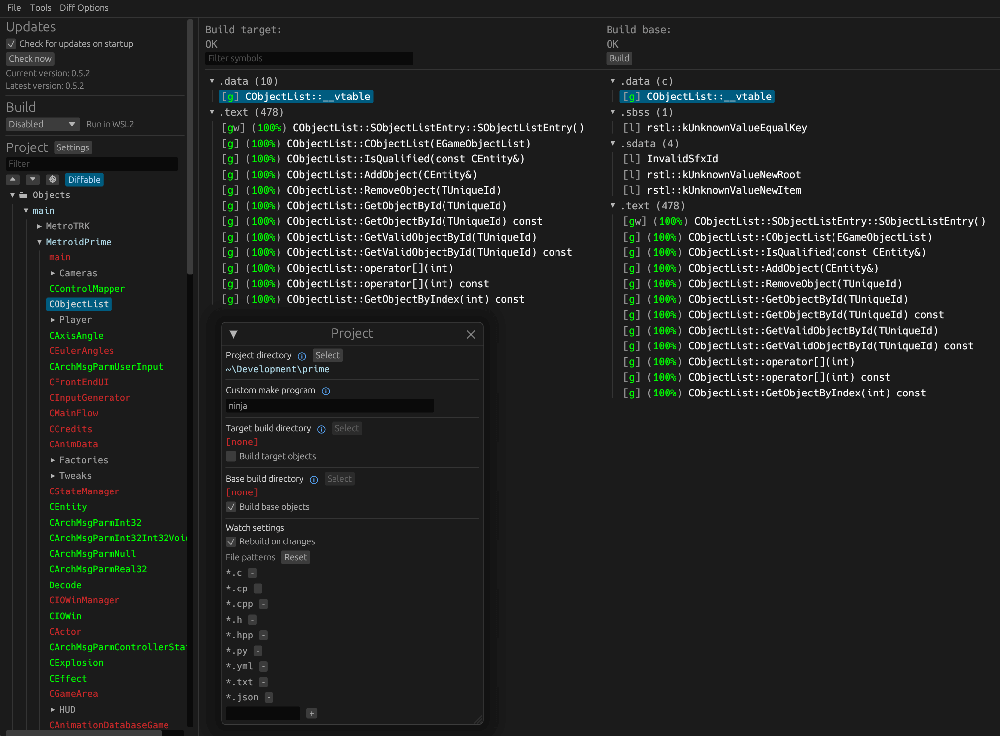

# Super Mario Sunshine — North American decompilation

This is a hobby fork of [doldecomp/sms](https://github.com/doldecomp/sms) focused on `GMSE01` (USA Rev 0).
The fork began from the upstream project when its Japanese decompilation was around 38% matched code.
AI has been used extensively to help reconstruct and match the North American game code; the resulting source is checked against the original binary.

## GMSE01 progress

As of 2026-09-23, the local `GMSE01` build report measures:

| Code | Fuzzy match | Perfect match | Fully linked |
| --- | ---: | ---: | ---: |
| Game | 99.36% | 64.00% | 16.98% |
| JSystem | 99.89% | 93.15% | 81.22% |
| SDK | 100.00% | 99.71% | 99.54% |
| **Total** | **99.48%** | **70.57%** | **31.73%** |

Fuzzy match measures approximate code similarity; perfect match counts bytes identical to the original; fully linked counts code built from matching source.
11,876 of 12,904 functions match exactly, and 527 of 732 object files are linked from source.
The rebuilt `mario.dol` is byte-identical to the original; unfinished objects still use code extracted from the user's own disc.
These USA figures are measured separately from the Japanese starting point.
See [current progress and open work](PROGRESS.md) and the [North American build notes](config/GMSE01/README.md).

The [native PC port](https://github.com/chasem-dev/sms-pc-port) uses this fork as its decompilation submodule.

## Versions and assets

This repository does **not** contain any game assets or assembly whatsoever. An existing copy of the game is required.

Supported versions:

- `GMSJ01`: Rev 0 (JPN)
- ~~`GMSP01`: Rev 0 (PAL)~~ slightly broken, feel free to fix
- `GMSE01`: Rev 0 (USA), the main target of this fork; see
  [North American build notes](config/GMSE01/README.md).

Dependencies
============

Windows
--------

On Windows, it's **highly recommended** to use native tooling. WSL or msys2 are **not** required.  
When running under WSL, [objdiff](#diffing) is unable to get filesystem notifications for automatic rebuilds.

- Install [Python](https://www.python.org/downloads/) and add it to `%PATH%`.
  - Also available from the [Windows Store](https://apps.microsoft.com/store/detail/python-311/9NRWMJP3717K).
- Download [ninja](https://github.com/ninja-build/ninja/releases) and add it to `%PATH%`.
  - Quick install via pip: `pip install ninja`

macOS
------

- Install [ninja](https://github.com/ninja-build/ninja/wiki/Pre-built-Ninja-packages):

  ```sh
  brew install ninja
  ```

- Install [wine-crossover](https://github.com/Gcenx/homebrew-wine):

  ```sh
  brew install --cask --no-quarantine gcenx/wine/wine-crossover
  ```

After OS upgrades, if macOS complains about `Wine Crossover.app` being unverified, you can unquarantine it using:

```sh
sudo xattr -rd com.apple.quarantine '/Applications/Wine Crossover.app'
```

Linux
------

- Install [ninja](https://github.com/ninja-build/ninja/wiki/Pre-built-Ninja-packages).
- For non-x86(_64) platforms: Install wine from your package manager.
  - For x86(_64), [wibo](https://github.com/decompals/wibo), a minimal 32-bit Windows binary wrapper, will be automatically downloaded and used.

Building
========

- Clone the repository:

  ```sh
  git clone https://github.com/chasem-dev/sms-english.git
  ```

- Copy your North American Rev 0 disc image to `orig/GMSE01`.
  - Supported formats: ISO (GCM), RVZ, WIA, WBFS, CISO, NFS, GCZ, TGC
  - After the initial build, the disc image can be deleted to save space.

- Configure:

  ```sh
  python3 configure.py --version GMSE01
  ```

  On Windows, use `python` instead of `python3`.
  To build another version, change the `--version` value and provide that version's disc image.

- Build:

  ```sh
  ninja
  ```

Diffing
=======

Once the initial build succeeds, an `objdiff.json` should exist in the project root.

Download the latest release from [encounter/objdiff](https://github.com/encounter/objdiff). Under project settings, set `Project directory`. The configuration should be loaded automatically.

Select an object from the left sidebar to begin diffing. Changes to the project will rebuild automatically: changes to source files, headers, `configure.py`, `splits.txt` or `symbols.txt`.


